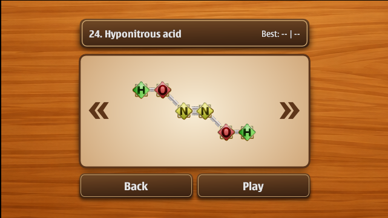
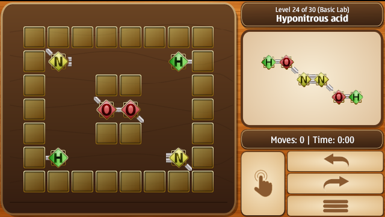

  <h1>AtomShift</h1>
  

  
A fun cross-platform puzzle game about atoms, molecules, and logical thinking — built with Qt.
   Slide atoms across the board to assemble the target molecule. Atoms move until they hit a wall or another atom — think before you shift!

---

## Features

- Friendly look and atmosphere
- Basic features (Undo/Redo/Restart)
- 110 levels
- Flexible controls: touch, keyboard, virtual D-pad
- Relaxing background soundtracks

---

## Screenshots

---

## Tested Devices

| Device | OS | Status |
|---|---|---|
| Desktop |  Windows 11  | ✅ Works (Unreleased) |
| Nokia E7 | Symbian Belle | ✅ Works |
| Nokia N8 | Symbian Belle Refresh | ✅ Works |
| Nokia 603 | Symbian Belle FP2 | ✅ Works |
| Nokia 5800 | Symbian S60v5 | ✅ Works |
| Nokia C5-03 | Symbian S60v5 | ✅ Works |
| Nokia C6 | Symbian S60v5 | ✅ Works |
| Nokia N97 | Symbian S60v5 | ✅ Works |
| Sony Ericsson Satio | Symbian S60v5 | ✅ Works (No sound) |
| Emulator | EKA2L1 | ✅ Works |

---

## Known Issues

- On Symbian S60v5 devices, animations may be slightly slow.
- Probably background music will not play on Sony Ericsson phones. Since Qt is not well-compatible with Sony Ericsson phones, the only solution is probably to use the Symbian API directly.

---

## To Do

- [ ] Cleaning the code
- [ ] Keeping the screen on
- [ ] Windows version
- [ ] Sound effects
- [ ] New level packs
- [ ] Android version
- [ ] High score leaderboard

---

## Special Thanks
- Classic Atomix game for the inspiration.
- Game logic, atoms gfx and level format based on [KAtomic](https://apps.kde.org/katomic/) by KDE Project (GPL)
- AI for creating the soundtracks, help with some parts of the code
- Beta Testers: [Nuru Dashdamirli](https://github.com/NuruDashdamir), [Arman Jussupgaliyev](https://github.com/shinovon) 
